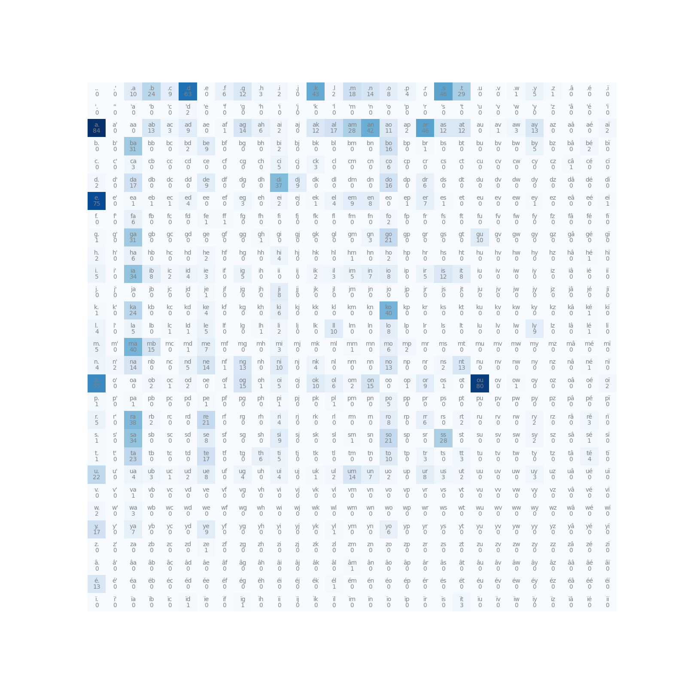

# Language Modeling From Scratch (LMFS) [Work in progress]

The repository contains a series of algorithms for language modeling (LM). I tried to use the LM to generate few malian family names.

## BiGRAM.

I arranged the the character as bigrams,

### Frequency

the objective is to generate the next charcter based on the first. I computed the probality distribution by using the the words frequency. More information in `bigram_count.py`. Here is the the frequency table:

Some generated names:

- zénema
- kïwicicio

## Perceptron.

The objective here is to minize the negative loss likelihood using the gradient descent algorithm. . More information in `bigram_perceptron.py`

Some generated names:

- yogarackoue
- mikiafanisa
- tame
- koma
- koko
